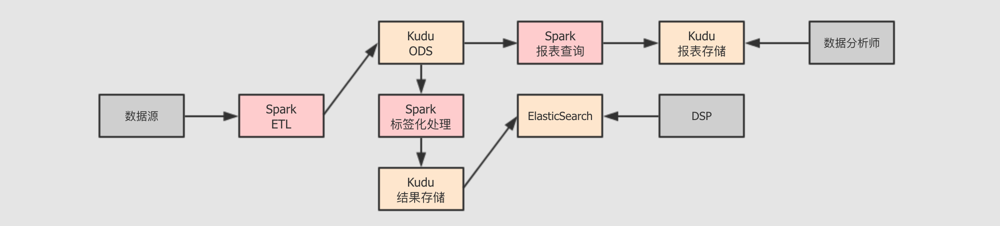
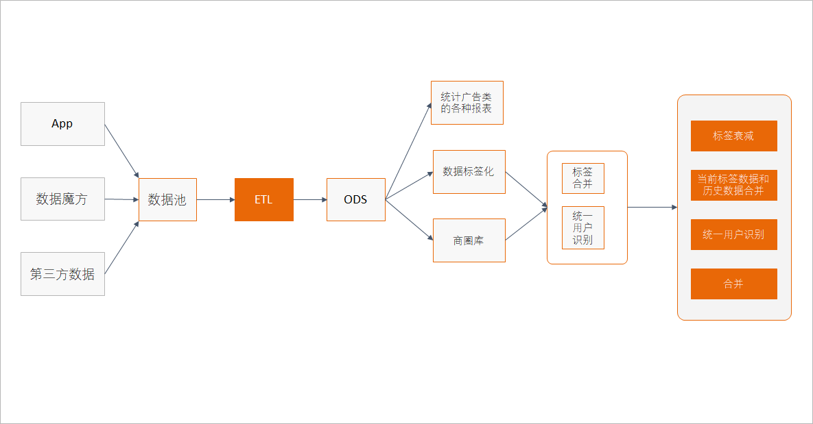
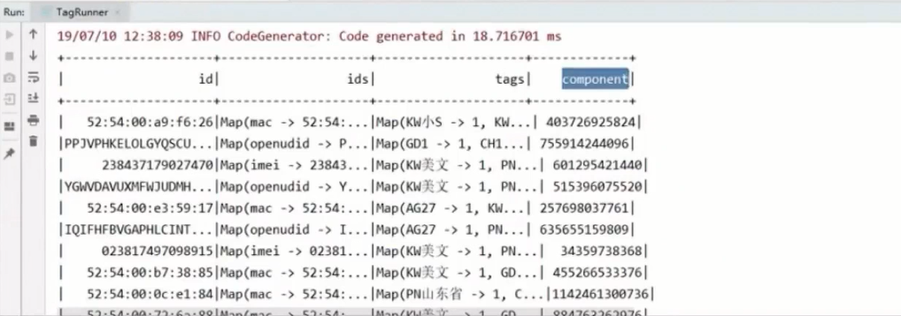

###   DMP广告投放系统（spark+kudu）
####   介绍
DSP 最重要的特性是, 能够帮助广告主筛选客户, 换句话说, DSP 出现之前广告主针对媒体上的广告位进行广告投放, DSP 出现之后, 广告主针对自己想要的目标受众投放广告, 这几乎是一个质的效率提升

广告主现在可以针对一些受众的标签来进行广告投放了, 比如说, 一个广告主是卖化妆品的, 他要投放广告给有如下三个标签的用户们, 20 岁上下, 女性, 时尚人士, 现在就可以针对这三个标签来告诉 DSP 如何筛选用户了

但是 DSP 如何进行用户识别呢? DSP 如何知道谁是 20 岁上下, 女性, 时尚人士? DSP 可以自己做, 也可以依赖于第三方. 这个标签化的数据管理项目, 就叫做 DMP, 全称叫做 Data Management Platform, 即数据管理平台.

#### 实现功能
- 商圈库
- 打标签
- 统一用户识别
- 标签合并 & 衰减
- 历史合并
####  架构

#### 主要任务

#### 图计算结果

